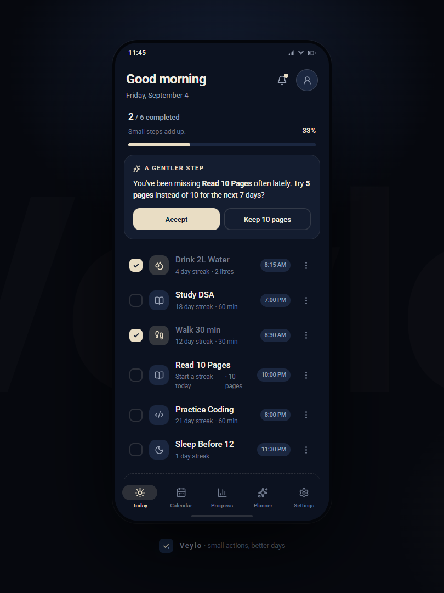
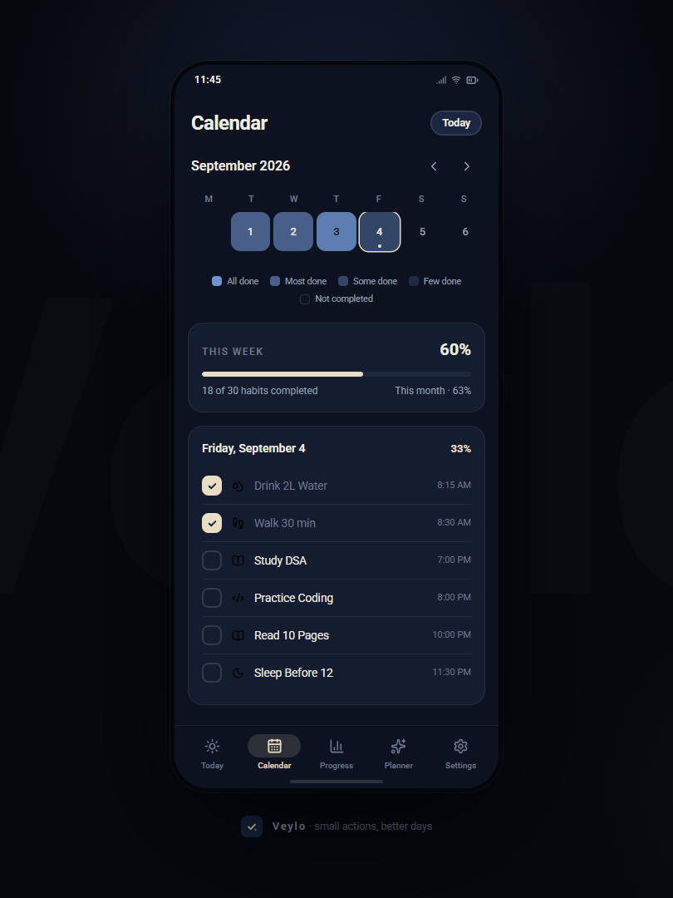
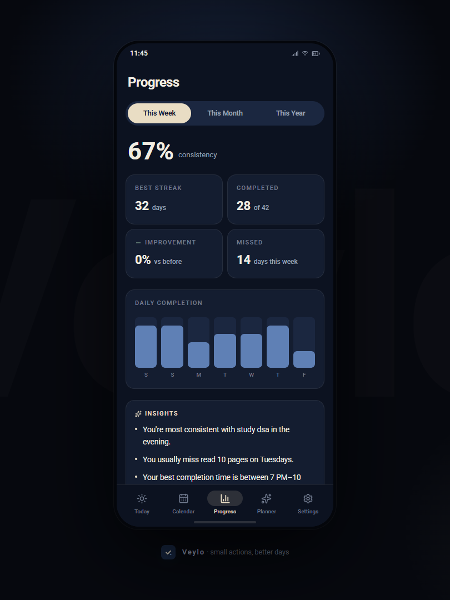
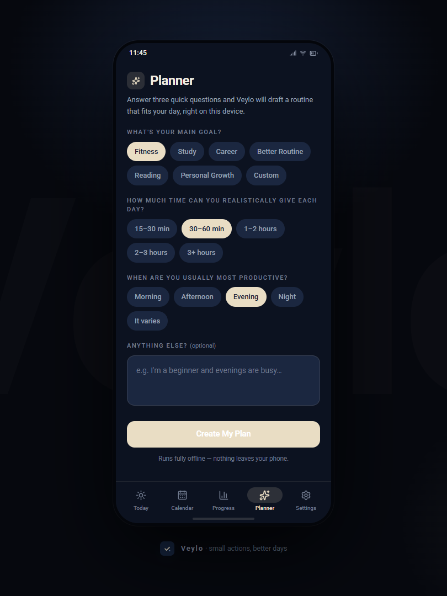
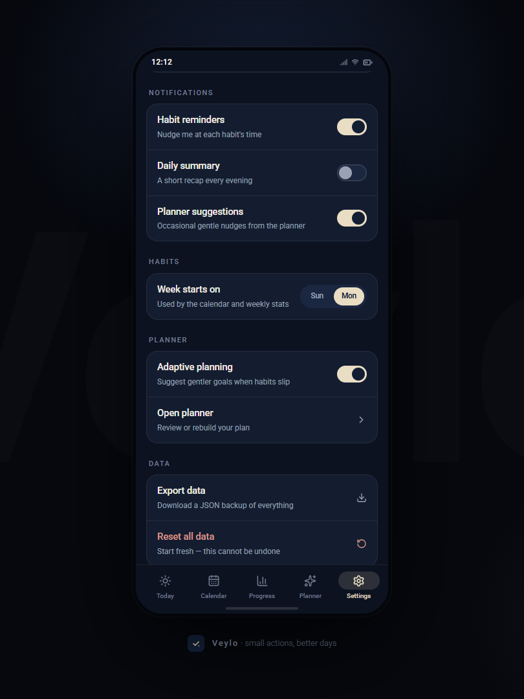
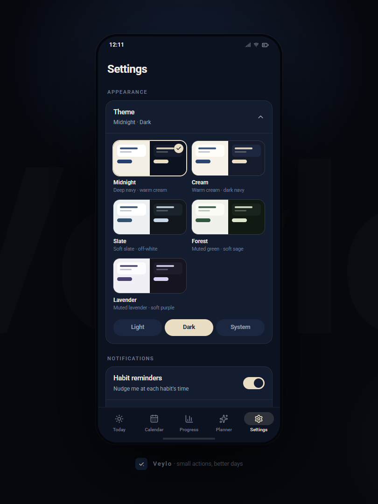

<div align="center">

# VEYLO

### Small habits. Better days.

**A minimal, privacy-first habit tracker for the browser.**

No accounts. No cloud. No noise. Just you, your habits, and the quiet satisfaction of showing up every day.

<br />


<br />

[Features](#-features) · [Screenshots](#-screenshots) · [Screens](#-screens) · [Tech Stack](#-tech-stack) · [Architecture](#-architecture) · [Planner](#-planner) · [Getting Started](#-getting-started) · [Contributing](#-contributing)

</div>

---

## Why VEYLO?

Most habit apps drown you in dashboards, gamification, and social features. VEYLO takes the opposite approach:

- **One screen for today.** Open the app, see your habits, check them off. Done.
- **Consistency over perfection.** Streaks and calendars show your pattern without guilt-tripping you for a missed day.
- **Your data, your device.** Everything lives in your browser's local storage. There is no server, no account, no tracking.
- **Installable.** Add it to your home screen and it behaves like a native app — even offline.

---

## 📸 Screenshots

<div align="center">

<table>
  <tr>
    <td align="center">
      <br />
      <sub><b>Today</b></sub>
    </td>
    <td align="center">
      <br />
      <sub><b>Calendar</b></sub>
    </td>
    <td align="center">
      <br />
      <sub><b>Progress</b></sub>
    </td>
  </tr>
  <tr>
    <td align="center">
      <br />
      <sub><b>Planner</b></sub>
    </td>
    <td align="center">
      <br />
      <sub><b>Settings</b></sub>
    </td>
    <td align="center">
      <br />
      <sub><b>Dark Mode</b></sub>
    </td>
  </tr>
</table>

</div>
---

## ✨ Features

### Core Habit Management

| Feature | How it works |
|---|---|
| **Create habits** | Name, optional description, frequency (daily / weekdays / custom), and category. A new habit appears immediately in Today. |
| **Complete a habit** | Tap the habit card to toggle completion for today. A satisfying animation confirms the action. |
| **Edit a habit** | Open the habit's detail view to change name, description, frequency, or category. |
| **Delete a habit** | Remove it entirely. Completion history for that habit is also removed. |
| **Archive a habit** | Soft-delete. The habit disappears from Today but its history is preserved for statistics. |
| **Reorder habits** | Drag or use up/down controls to set your preferred display order. |

### Tracking & Visualization

| Feature | How it works |
|---|---|
| **Streak tracking** | For each habit, VEYLO calculates your *current streak* (consecutive days ending today or yesterday) and *longest streak* (all-time best). |
| **Calendar view** | A monthly grid where each day is shaded by completion ratio. Tap a day to see exactly which habits were done. |
| **Progress dashboard** | Aggregated stats: overall completion %, per-habit streaks, weekly bar chart, monthly summary. |
| **Completion history** | Every check-in is timestamped by date, giving a full longitudinal record. |

### Planner

A **rule-based** scheduling assistant (no AI, no API calls). You tell it what habits you want to build and when you have time; it distributes them across your day using load-balancing heuristics.

### Experience

| Feature | How it works |
|---|---|
| **Themes** | Light, Dark, or System (follows OS preference). Choice persists across sessions. |
| **Animations** | Framer Motion powers micro-interactions: card taps, screen transitions, streak increments. |
| **PWA / Offline** | Installable via browser. Service worker caches the app shell so it loads and works with zero connectivity. |
| **Local-only data** | All state is serialized to `localStorage`. No network requests are ever made for data. |

---

## 📱 Screens

### Today

The home screen. Shows every **active** (non-archived) habit for the current date, grouped by category. Each card displays:

- Habit name and category badge
- Current streak (e.g., "🔥 12 days")
- A large tap target to toggle completion
- A subtle color shift when completed

A header shows today's date and an overall "X of Y done" counter.

### Calendar

A standard 7-column monthly grid. Each cell is filled with a color whose intensity maps to the **completion ratio** for that day (0% → empty, 100% → full color). Navigating months is a swipe or arrow tap. Tapping a specific day opens a detail panel listing every habit and whether it was completed.

### Progress

A statistics screen with:

- **Overall completion rate** for the selected period (week / month / all-time)
- **Per-habit streak cards** — current and longest streak
- **Weekly bar chart** — 7 bars, one per day, showing completions
- **Monthly summary** — total expected vs. total completed, with a percentage ring

All numbers are computed client-side from the stored completion array. No server round-trips.

### Planner

A multi-step guided flow:

1. **Select habits** — pick which habits to schedule.
2. **Define time windows** — e.g., "7–9 AM", "12–1 PM", "6–8 PM".
3. **Set frequency** — daily, weekdays, or custom days.
4. **Review & apply** — the planner outputs a suggested daily layout. Accept, edit, or discard.

The planner is fully offline and deterministic.

### Settings

- Theme picker (Light / Dark / System)
- App version and about info
- Reset all data (with confirmation dialog)

---

## 🛠 Tech Stack

| Technology | Role |
|---|---|
| **React 18** | UI layer. Functional components + hooks. No class components. |
| **TypeScript 5** | Static typing across the entire codebase. Strict mode enabled. |
| **Vite 6** | Dev server (HMR) and production bundler (Rollup under the hood). |
| **Tailwind CSS 3** | Utility-first styling. No custom CSS files beyond `index.css` for base resets. |
| **Framer Motion 11** | Declarative animations: layout transitions, tap springs, staggered lists. |
| **Lucide React** | 300+ stroke-based icons. Tree-shaken at build time. |
| **date-fns** | Immutable date utilities (formatting, adding days, start/end of month, etc.). |
| **vite-plugin-pwa** | Generates `sw.js` (service worker) and `workbox-*.js` at build time. |

> **No backend. No database. No authentication. No third-party API calls.**

---

## 🏗 Architecture

VEYLO is a **client-side single-page application**. There is no server component.

```
┌─────────────────────────────────────────────────────────┐
│                    BROWSER (Client)                     │
│                                                         │
│  ┌───────────────────────────────────────────────────┐  │
│  │              React Component Tree                 │  │
│  │                                                   │  │
│  │   App.tsx                                         │  │
│  │    ├── <HabitProvider>  (Context + state)         │  │
│  │    ├── <ThemeProvider>   (Context + state)        │  │
│  │    └── <Screens>                                  │  │
│  │         ├── Today                                 │  │
│  │         ├── Calendar                              │  │
│  │         ├── Progress                              │  │
│  │         ├── Planner                               │  │
│  │         └── Settings                              │  │
│  └───────────────────────────────────────────────────┘  │
│                         │                               │
│                         ▼                               │
│  ┌───────────────────────────────────────────────────┐  │
│  │              Business Logic (pure fns)            │  │
│  │                                                   │  │
│  │   lib/statistics.ts   → streaks, rates, charts    │  │
│  │   lib/planner.ts      → scheduling heuristics     │  │
│  │   lib/storage.ts      → localStorage read/write   │  │
│  │   utils/date.ts       → date-fns wrappers         │  │
│  └───────────────────────────────────────────────────┘  │
│                         │                               │
│                         ▼                               │
│  ┌───────────────────────────────────────────────────┐  │
│  │           Persistence: localStorage               │  │
│  │                                                   │  │
│  │   key "veylo:habits"       → Habit[]              │  │
│  │   key "veylo:completions"  → Completion[]         │  │
│  │   key "veylo:theme"        → "light"|"dark"|"sys" │  │
│  └───────────────────────────────────────────────────┘  │
│                                                         │
│  ┌───────────────────────────────────────────────────┐  │
│  │         Service Worker (vite-plugin-pwa)          │  │
│  │         Caches: HTML, JS, CSS, icons              │  │
│  │         Strategy: precache app shell              │  │
│  └───────────────────────────────────────────────────┘  │
└─────────────────────────────────────────────────────────┘
```

### Data flow

```
User taps "Complete" on a HabitCard
        │
        ▼
HabitCard calls useHabits().toggleCompletion(habitId, today)
        │
        ▼
HabitContext: updates completions array in React state
        │
        ├──► lib/storage.ts: writes updated array to localStorage
        │
        ├──► lib/statistics.ts: recomputes streak for that habit
        │
        └──► React re-renders:
              • HabitCard shows "completed" state
              • StreakBadge increments with animation
              • Today header counter updates
```

### Key design decisions

- **Context over external state libraries.** The app has two state slices (habits, theme). React Context + `useReducer` is sufficient and avoids dependency bloat.
- **Pure functions for logic.** Streak calculation, planner scheduling, and statistics are all exported as pure functions with no side effects.
- **Flat completion array.** Rather than nesting completions inside each habit object, completions are a separate flat array. This makes filtering by date or habit a single O(n) pass.
- **Tailwind for all styling.** No CSS modules, no styled-components. Custom design tokens live in `tailwind.config.js`.

---

## 📁 Project Structure

```
Veylo/
├── public/
│   ├── manifest.webmanifest        # PWA manifest
│   ├── icons/
│   │   ├── icon-192.png            # PWA icon (small)
│   │   └── icon-512.png            # PWA icon (large)
│   └── favicon.svg
├── screenshots/                    # README screenshots
│   ├── today.png
│   ├── calendar.png
│   ├── progress.png
│   ├── planner.png
│   ├── settings.png
│   └── dark-mode.png
├── src/
│   ├── components/                 # Reusable UI components
│   │   ├── HabitCard.tsx           # Single habit row in Today view
│   │   ├── HabitForm.tsx           # Create / Edit habit modal
│   │   ├── CalendarGrid.tsx        # Monthly calendar with heat cells
│   │   ├── DayDetail.tsx           # Habits done on a specific day
│   │   ├── StreakBadge.tsx         # Animated streak counter
│   │   ├── ProgressRing.tsx        # Circular completion percentage
│   │   ├── WeeklyBarChart.tsx      # 7-bar chart for the week
│   │   ├── PlannerForm.tsx         # Multi-step planner input
│   │   ├── PlannerResult.tsx       # Generated schedule display
│   │   ├── ThemeToggle.tsx         # Light / Dark / System switcher
│   │   ├── BottomNav.tsx           # Tab bar navigation
│   │   ├── Modal.tsx               # Generic overlay modal
│   │   └── ConfirmDialog.tsx       # Destructive-action confirmation
│   ├── screens/                    # Top-level pages (one per tab)
│   │   ├── Today.tsx
│   │   ├── Calendar.tsx
│   │   ├── Progress.tsx
│   │   ├── Planner.tsx
│   │   └── Settings.tsx
│   ├── context/                    # React Context providers
│   │   ├── HabitContext.tsx        # habits[], completions[], CRUD actions
│   │   └── ThemeContext.tsx        # theme mode, toggle, persistence
│   ├── lib/                        # Core business logic (pure functions)
│   │   ├── statistics.ts           # Streaks, completion rates, aggregates
│   │   ├── planner.ts              # Rule-based scheduling engine
│   │   └── storage.ts              # localStorage get/set/serialize helpers
│   ├── hooks/                      # Custom hooks
│   │   ├── useHabits.ts            # Wrapper around HabitContext
│   │   └── useTheme.ts             # Wrapper around ThemeContext
│   ├── types/                      # TypeScript interfaces
│   │   └── index.ts                # Habit, Completion, Frequency, ThemeMode
│   ├── utils/                      # Small helpers
│   │   └── date.ts                 # date-fns wrappers
│   ├── App.tsx                     # Root: providers + tab routing
│   ├── main.tsx                    # Entry point
│   └── index.css                   # Tailwind directives + base resets
├── index.html
├── package.json
├── vite.config.ts
├── tailwind.config.js
├── postcss.config.js
├── tsconfig.json
├── tsconfig.app.json
├── eslint.config.js
└── README.md
```

---

## 📊 Data Model

### Habit

```typescript
type Frequency = "daily" | "weekdays" | "custom";

interface Habit {
  id: string;
  name: string;
  description?: string;
  frequency: Frequency;
  customDays?: number[];
  category?: string;
  color?: string;
  archived: boolean;
  createdAt: string;
  order: number;
}
```

### Completion

```typescript
interface Completion {
  habitId: string;
  date: string;      // "YYYY-MM-DD"
}
```

Completions are stored as a **flat array**. A habit is "done" on a given day if a matching `{ habitId, date }` entry exists.

- **What was done on a date?** → `completions.filter(c => c.date === "2025-01-15")`
- **Was habit X done today?** → `completions.some(c => c.habitId === id && c.date === today)`
- **Delete habit X** → `completions.filter(c => c.habitId !== id)`

### Planner

```typescript
interface TimeSlot {
  label: string;
  start: string;
  end: string;
}

interface PlannerInput {
  habitIds: string[];
  timeSlots: TimeSlot[];
  frequency: Frequency;
}

interface PlannerOutput {
  schedule: {
    habitId: string;
    slotLabel: string;
    suggestedTime: string;
  }[];
}
```

### localStorage Keys

| Key | Value |
|---|---|
| `veylo:habits` | `JSON.stringify(Habit[])` |
| `veylo:completions` | `JSON.stringify(Completion[])` |
| `veylo:theme` | `"light"` \| `"dark"` \| `"system"` |

---

## 🧠 Planner

The planner is a **deterministic, rule-based scheduler**. It does **not** use any AI model, LLM, or external API.

### What the user provides

1. **Which habits** to include in the plan.
2. **Time windows** — e.g., "7 AM – 9 AM", "12 PM – 1 PM", "6 PM – 8 PM".
3. **Frequency** — daily, weekdays, or specific days.

### How it works

```
1. Parse inputs: habit list, time slots, frequency.
2. Calculate available slots per time window.
3. Distribute habits using round-robin load balancing:
   - Assign the next habit to the slot with the fewest assignments.
   - Respect morning/evening preferences if set.
4. Check against existing active habits to avoid conflicts.
5. Output an ordered schedule for the user to accept or edit.
```

### Properties

- **Offline** — zero network calls.
- **Deterministic** — same input always produces the same output.
- **User-controlled** — the plan is a suggestion that must be explicitly accepted.
- **Non-destructive** — rejecting the plan changes nothing.

---

## 📈 Statistics

All statistics are computed **client-side** as pure functions. No server, no caching layer.

| Metric | Logic |
|---|---|
| **Completion rate** | Days where all active habits were done ÷ total active days × 100 |
| **Current streak** | Walk backwards from today counting consecutive completed days. Stop at first gap. |
| **Longest streak** | Scan entire history for the maximum run of consecutive days. |
| **Weekly completions** | Per-day completion count for the last 7 days. |
| **Monthly summary** | Total completions ÷ (active habits × days in month). |
| **Calendar intensity** | Completions on that day ÷ active habits that applied that day → color scale. |

### Edge cases

- A habit created mid-week doesn't count against earlier days.
- Archived habits are excluded from active counts but included in historical streaks.
- "Weekdays" frequency means Saturday/Sunday misses don't break the streak.

---

## 📴 Offline & Local Data

All application data is persisted in **`localStorage`**.

- **Stored:** habits, completions, theme preference.
- **Not stored:** anything else. No server, no IndexedDB, no file system access.
- **Size:** A year of daily habits across 10 habits is roughly 50 KB. Well within the 5–10 MB `localStorage` quota.

The **service worker** precaches the application shell (HTML, JS, CSS, icons). Once cached, the app loads and functions entirely offline. No API calls are made at runtime.

**Data loss scenarios:** clearing browser data, switching browsers or devices, or using incognito mode.

---

## 📲 PWA

VEYLO is a **Progressive Web App** installable on Chrome, Edge, Safari, and Firefox.

| File | Purpose |
|---|---|
| `public/manifest.webmanifest` | App name, icons, `display: "standalone"`, theme color, start URL |
| `public/icons/icon-192.png` | Small app icon |
| `public/icons/icon-512.png` | Large app icon |
| `vite.config.ts` → `VitePWA()` | Service worker generation and caching strategy |

### Service worker

Generated at build time by `vite-plugin-pwa`:

1. **Precache** — downloads and caches all build assets on first visit.
2. **Navigation fallback** — serves cached HTML for any navigation request.
3. **Stale-while-revalidate** — serves cached assets immediately, refreshes in background.

### Installation

- **Mobile:** Tap "Add to Home Screen" in the browser prompt or share menu.
- **Desktop:** Click the install icon in the address bar.
- Opens in a **standalone window** with its own icon and name.

---

## 🎨 Theme System

| Mode | Behavior |
|---|---|
| **Light** | Forces the light palette. |
| **Dark** | Forces the dark palette. |
| **System** | Follows `prefers-color-scheme`. Updates live if the OS theme changes. |

- Theme is stored in `localStorage` under `"veylo:theme"`.
- A `dark` class is toggled on `<html>` using Tailwind's `darkMode: "class"` strategy.
- The preference persists across sessions and is applied before first paint to prevent flash.

---

## 🚀 Getting Started

### Prerequisites

- **Node.js** ≥ 18
- **npm** ≥ 9

### Clone & Run

```bash
git clone https://github.com/hmmlavi/Veylo.git
cd Veylo
npm install
npm run dev
```

The dev server starts at **http://localhost:5173**.

### Production Build

```bash
npm run build
```

Output is written to `./dist/`. Deploy to any static host: Netlify, Vercel, GitHub Pages, Cloudflare Pages, etc.

```bash
npm run preview
```

Preview the production build locally.

### Available Scripts

| Command | Description |
|---|---|
| `npm install` | Install dependencies |
| `npm run dev` | Start Vite dev server with HMR |
| `npm run build` | Type-check and bundle to `dist/` |
| `npm run preview` | Preview the production build |
| `npm run lint` | Run ESLint |

---

## 🔧 Development

### Adding a new screen

1. Create `src/screens/MyNewScreen.tsx`.
2. Add a tab entry in `BottomNav.tsx`.
3. Wire it in `App.tsx`.
4. Use `useHabits()` for data access.

### Adding a new component

1. Create the file in `src/components/`.
2. Keep it presentational — data via props, events via callbacks.
3. Use Tailwind for styling, Framer Motion for animation.

### Adding business logic

- **Statistics** → `src/lib/statistics.ts` — pure functions.
- **Planner** → `src/lib/planner.ts` — add rules as composable functions.
- **Date helpers** → `src/utils/date.ts`.

### State management

- **Habits & completions** → `HabitContext` via `useHabits()`.
- **Theme** → `ThemeContext` via `useTheme()`.
- **Local UI state** → `useState` / `useReducer` in the component.

### Conventions

- TypeScript strict mode. No `any`.
- Functional components only.
- Tailwind for all styling.
- Pure functions in `lib/`. Side effects in context or hooks.
- Framer Motion for orchestrated animations.

---

## 🔒 Privacy & Data

| Question | Answer |
|---|---|
| Backend server? | **No.** |
| Data sent to third parties? | **No.** |
| Analytics or tracking? | **No.** |
| User authentication? | **No.** |
| Where is data stored? | **`localStorage` in your browser.** |
| Can the developer see your data? | **No.** It never leaves your device. |

VEYLO makes **zero network requests** after the initial page load.

---

## ⚠️ Limitations

- **No cloud sync.** Data lives in one browser only.
- **No user accounts.** No login, no profiles, no multi-device support.
- **No push notifications.** Not currently implemented.
- **Planner is heuristic.** Fixed load-balancing rules, not machine learning.
- **localStorage is not encrypted.** Accessible to any JS on the same origin.
- **PWA ≠ native app.** No background tasks, widgets, or app-store distribution.
- **No cross-device sync.** Two devices don't know about each other.
- **Browser storage limits.** ~5 MB cap, sufficient for years of habit data.

---

## 🗺 Roadmap

### ✅ Completed

- [x] Habit CRUD (create, view, edit, delete)
- [x] Habit archiving with preserved history
- [x] Daily completion tracking with tap-to-toggle
- [x] Current & longest streak calculation
- [x] Monthly calendar with completion heatmap
- [x] Progress dashboard (completion rate, weekly chart, monthly summary)
- [x] Rule-based adaptive planner
- [x] Light / Dark / System theme with persistence
- [x] PWA with service worker and offline support
- [x] Local-only data storage
- [x] Framer Motion micro-animations
- [x] TypeScript strict mode throughout

### 🔜 Planned

- [ ] Data export / import (JSON backup)
- [ ] Custom habit categories with user-defined colors
- [ ] Drag-and-drop reordering
- [ ] Browser Notification API reminders
- [ ] Weekly / monthly review summaries
- [ ] Habit templates
- [ ] Optional cloud sync
- [ ] Android / iOS wrappers via Capacitor or TWA
- [ ] Accessibility audit
- [ ] Unit tests for `lib/`

---

## 🤝 Contributing

```bash
git clone https://github.com/hmmlavi/Veylo.git
cd Veylo
git checkout -b feat/my-feature
npm install
npm run dev
npm run lint
npm run build
git add .
git commit -m "feat: add my feature"
git push origin feat/my-feature
```

- Keep PRs small and focused.
- Follow the existing code style.
- Update types in `src/types/` for new data shapes.
- Test in both light and dark themes.

---

## 👤 Author

[hmmlavi](https://github.com/hmmlavi)

---

<div align="center">

**Small habits. Better days.**

*Built with React, TypeScript, and a lot of ☕*

</div>
